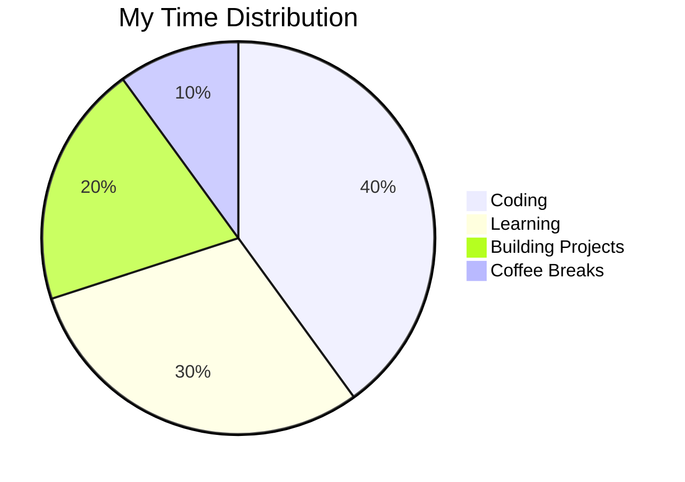

<div align="center">
  
#  Hey there, I'm Harsh Raj!


</div>

---

##  About Me

```javascript
const harsh = {
    location: "IIIT Kalyani, West Bengal 🎓",
    currentFocus: "AI/ML & Full Stack Development",
    workingOn: "Building innovative web applications",
    lookingTo: "Collaborate with passionate developers",
    funFact: "I'm too lazy until I get some work 😄",
    motto: "Code. Learn. Repeat. 🔄"
};
```

- 🔭 **Currently:** Student at **IIIT Kalyani**
- 🌱 **Learning:** AI/ML and Advanced Web Technologies
- 👯 **Open to:** Collaborations on Web Development Projects
- 💬 **Ask me about:** React, Node.js, MongoDB, Express
- ⚡ **Fun fact:** Procrastination turns into productivity mode! 🚀
- 🎯 **2025 Goals:** Master AI/ML & Build 10+ Full Stack Projects


---

##  Tech Stack & Tools

<div align="center">

### 👨‍💻 Languages


### 🎨 Frontend


### ⚙️ Backend


### 🗄️ Database


### 🛠️ Tools & Platforms


### ☁️ Hosting


### 🤖 AI Tools


</div>


---

##  GitHub Stats

<div align="center">


</div>


---

##  Contribution Activity

<div align="center">
  
[](https://github.com/ashutosh00710/github-readme-activity-graph)

</div>


---


<!--  -->


<!-- ## 🔥 Featured Projects

<div align="center">

[](https://github.com/Harshraj112/Omnifood_delivery_app)
[](https://github.com/Harshraj112/Notepad_Extension)

[](https://github.com/Harshraj112/Winter-of-Code-5.0)
[](https://github.com/Harshraj112/Car_dekhoo)

</div> -->

<!--  -->

---

## 💻 Workspace & Setup

```text
💻 Device: Custom Built PC
🖥️ Monitor: Dual Monitor Setup
⌨️ Keyboard: Mechanical Keyboard
🖱️ Mouse: Wireless Gaming Mouse
🎧 Headphones: Over-Ear Headphones
☕ Fuel: Coffee & Code
```


---

## 🎯 Current Focus

<div align="center">



</div>


---

## 🌐 Connect With Me

<div align="center">

[](https://buildbyharsh.netlify.app/)
[](https://www.linkedin.com/in/harshraj112/)
[](mailto:harshraj250106@gmail.com)
[](https://x.com/HarshRa08880363)
[](https://www.instagram.com/_harsh_raj_112/)
[](https://discord.gg/harsh_roy0293_13363)
[](https://www.reddit.com/user/ThinConcert9862/)
[](https://stackoverflow.com/users/28028953/harsh-raj)

</div>

---

<div align="center">
  
### 💭 Random Dev Quote


### 📊 Profile Summary


<!-- ### 🎖️ GitHub Badges

 -->

</div>

---

<div align="center">

### 🎨 Language & Tools Cloud


</div>

---

<div align="center">
  


### 💖 Show some love by starring repositories!


[](https://github.com/Harshraj112)
[](https://github.com/Harshraj112)

**Made with ❤️ and lots of ☕**

</div>
